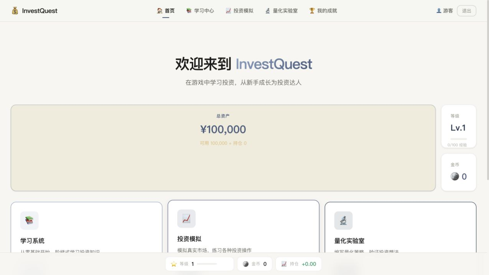
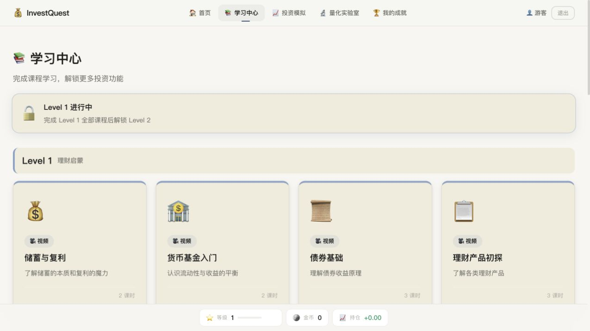
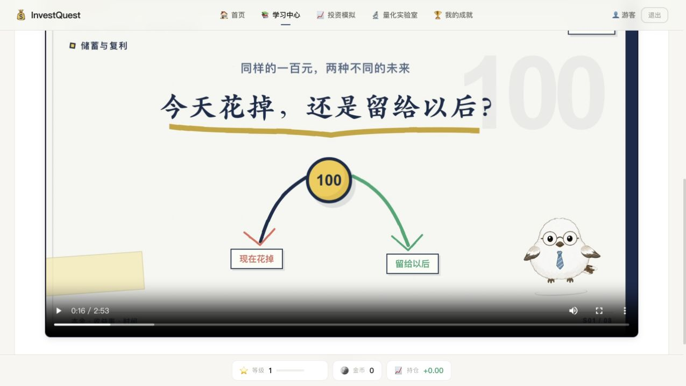
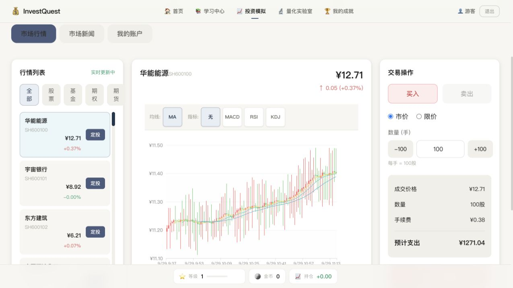

# InvestQuest · 投资探索者

一个面向投资新手的中文游戏化学习项目，把金融知识课程、虚拟交易和量化策略实验放进同一个学习空间。

通过「学知识 → 做模拟 → 试策略」的路径，理解储蓄、基金、股票、期权与期货的基本概念，并用经验值、金币和成就记录学习进度。

## 项目功能

- **课程学习**：分级课程、知识讲解、答题与部分课程视频。
- **投资模拟器**：虚拟账户、模拟行情、买卖操作和持仓记录。
- **量化实验室**：策略配置、技术指标、模拟回测与参数实验。
- **个人中心**：查看学习进度、等级、成就与交易记录。
- **登录与游客体验**：Supabase 邮箱认证，以及本地游客模式。
- **课程动画素材**：仓库内保留部分视频制作工程和共享角色资源。

## 界面预览

以下截图来自项目实际运行界面，使用游客模式；账户金额、行情和持仓均为模拟数据。

### 首页

从账户概览进入课程学习、投资模拟与量化实验。



### 课程学习

按等级组织课程，从储蓄、复利等基础概念开始学习。



### 课程视频

「储蓄与复利」课程的实际播放画面，以动画和角色讲解呈现金融概念。



### 投资模拟

查看模拟行情、K 线与技术指标，在虚拟资金环境中练习交易操作。



## 技术栈

React 18 · TypeScript · Vite · React Router · Zustand · ECharts · Framer Motion · Supabase Auth

## 本地运行

准备 Node.js 22 与 npm，以及你自己的 Supabase 项目。

```bash
git clone https://github.com/cnst27dsjv-cell/Finance-public.git
cd Finance-public
npm ci
cp .env.example .env.local
```

编辑 `.env.local`，填入自己的项目配置：

```dotenv
VITE_SUPABASE_URL=https://your-project.supabase.co
VITE_SUPABASE_ANON_KEY=your-publishable-key
```

`VITE_SUPABASE_ANON_KEY` 是现有代码使用的变量名，可填入 Supabase 的客户端 publishable key；旧版 anon key 也兼容。不要填入 secret key 或 service_role key。所有 `VITE_` 变量都会暴露给浏览器，不能用于保存服务端秘密。参见 [Supabase API key 说明](https://supabase.com/docs/guides/api/api-keys)。

在 Supabase 中启用邮箱登录，并为部署地址配置相应的认证 URL。当前应用初始化时会创建 Supabase 客户端，因此即使使用游客模式，也需要有效格式的项目配置。

```bash
npm run dev
```

打开终端提示的本地地址。

## 构建与部署

```bash
npm run build
npm run preview
```

构建输出位于 `dist/`，可部署到支持单页应用的静态托管服务。部署时需设置上述两个环境变量，并配置路由回退到 `index.html`。仓库的 `public/_redirects` 提供了相应的重定向配置。

## 目录结构

```text
src/
  components/   通用界面组件与图表
  pages/        学习、模拟交易、量化实验室等页面
  stores/       认证、学习进度、行情与策略状态
  lib/          Supabase 客户端
  utils/        技术指标工具
public/         网站静态素材
video/          部分课程动画工程与共享角色素材
docs/          设计说明与制作文档
PRD.md          产品设计说明
```

视频工程有各自的依赖和制作说明，不是运行网站的必要步骤；部分导出视频和本地制作工具不包含在仓库中。当前课程播放使用外部托管的视频地址，自行部署时可在 `src/pages/Learning.tsx` 中替换为自己的视频资源。

## 当前边界

- 行情与回测基于模拟数据，不接入真实证券交易或实时市场行情。
- 学习进度、持仓和策略主要保存在浏览器本地；清除浏览器数据会丢失这些记录，也不提供跨设备同步。
- 项目用于学习和演示，模拟收益不能用于判断真实投资表现。
- 产品设计文档包含规划和历史说明，实际功能以当前代码为准。

## 参与贡献

欢迎提交 Issue 反馈问题或通过 Pull Request 改进项目。提交前请运行 `npm run build`，并检查改动中没有环境配置、访问令牌或个人信息。

请勿提交 `.env.local`、私钥、账户数据或本地工具运行记录。示例配置只使用占位符。

## 授权说明

仓库公开供查看和交流；目前尚未指定开源许可证。第三方依赖与素材仍遵循各自的授权，公开仓库不代表自动授予所有代码和素材的使用权。
